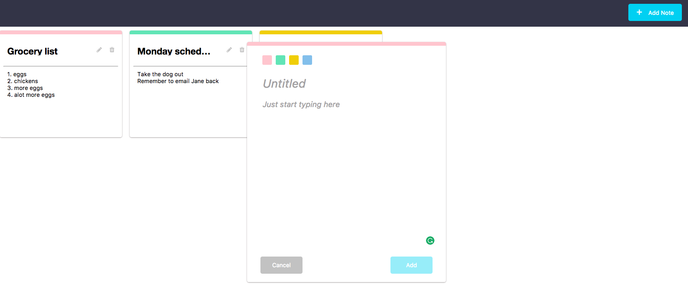

# Note4u

Note taking application built on React using create-react-app.

Link: https://note4u.herokuapp.com/

### Steps to start:
1. **yarn install** to get all dependencies
2. **yarn start** to start the app on port 3000 (Go to http://localhost:3000)
3. **yarn nodemon** (if nodemon is installed) otherwise **yarn server** to start Node.JS server on port 3001 (Go to http://localhost:3001)
4. **yarn run build** to generate build pack
4. Happy coding!

### Dependencies:
- React (made with create-react-app)
- Express.JS (node version 8.1.4)
- body-parser

### Overview:
- Responsive post-it note application built with React and CSS3
- Node.JS with Express for a lightweight back end server
